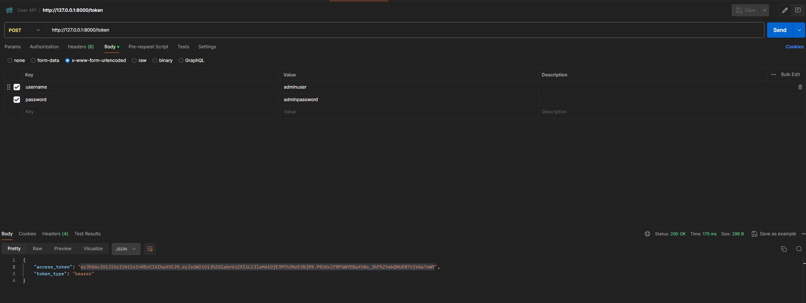
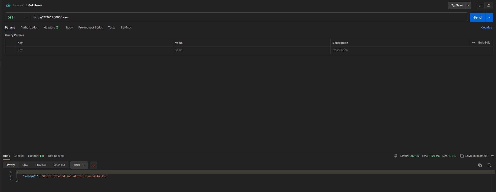
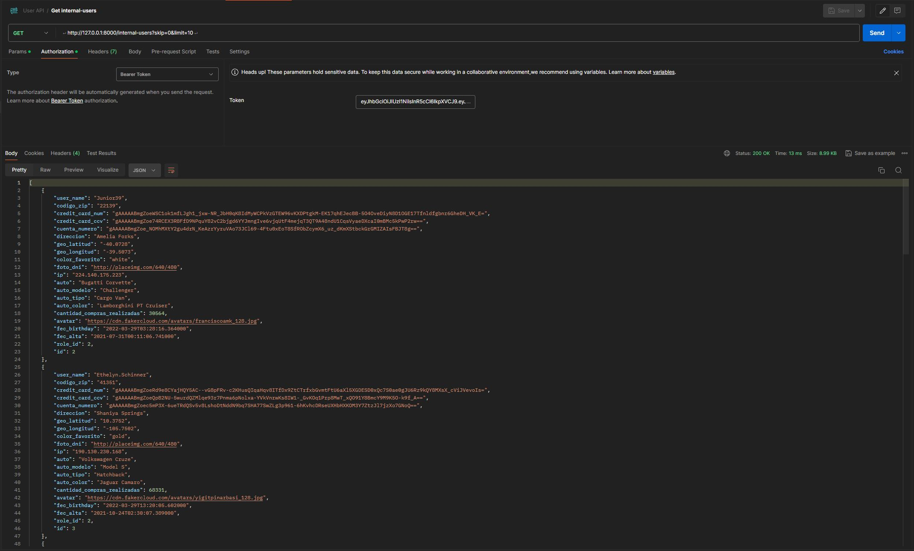
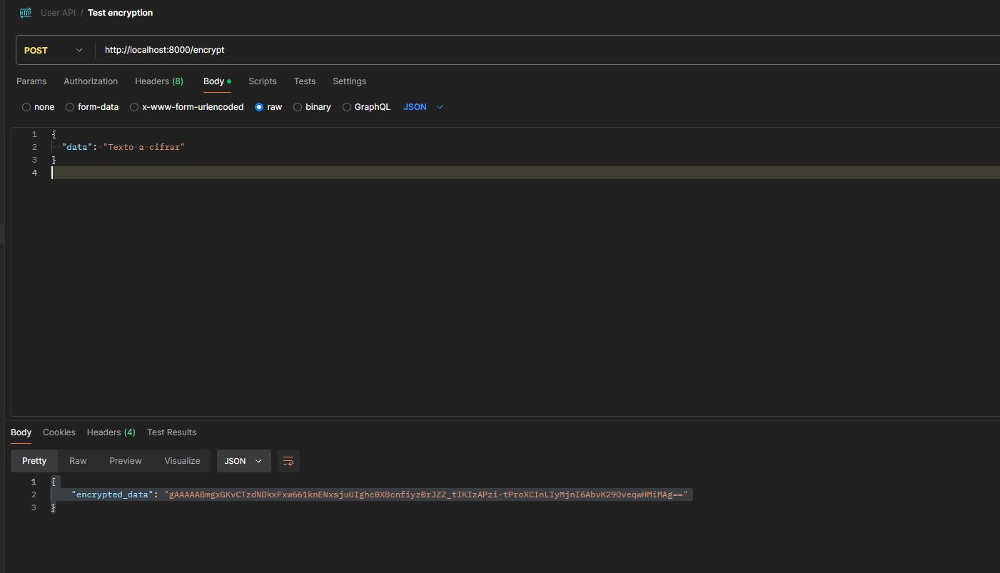
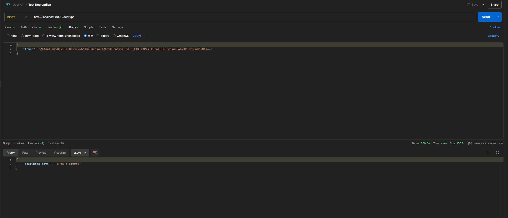
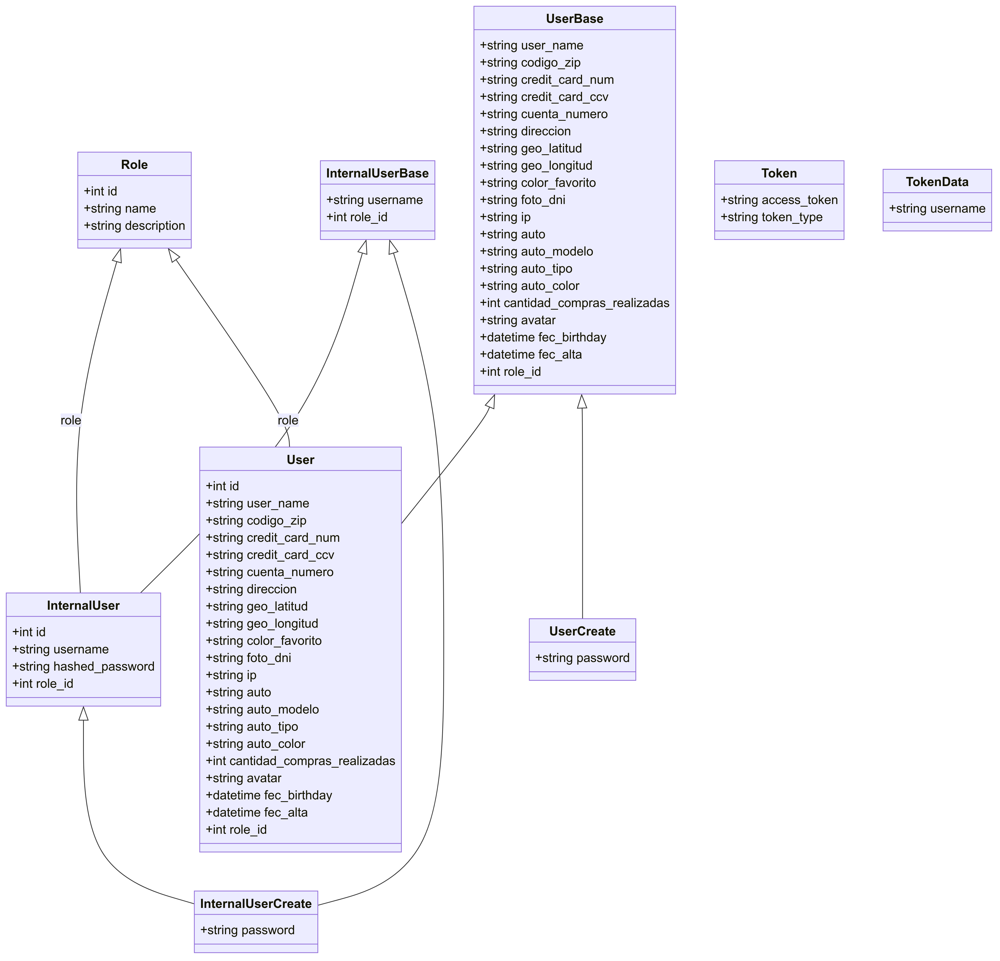

# Challenge - Seguridad Informática

## Objetivo

El objetivo del proyecto es obtener información de clientes desde un proveedor externo, garantizar que la información esté asegurada en todos sus estados y disponibilizar recursos para que la misma sea accesible por distintos sectores dentro de la empresa.

## Tecnologías Utilizadas

- Python
- FastAPI
- SQLAlchemy
- PostgreSQL
- Vault
- Docker

## Instalación y Ejecución

1. Clonar el repositorio.

   ```bash
   git clone https://github.com/tu-repo.git
   cd tu-repo
   ```

2. Crear una `SECRET_KEY` de forma segura utilizando `openssl`.

   ```bash
   openssl rand -hex 32
   ```

3. Crear un archivo `.env` en el directorio raíz con el siguiente contenido:

   ```
   SQLALCHEMY_DATABASE_URL=postgresql://challenge_user:newpassword@db/challenge_db
   VAULT_ADDR=http://vault:8200
   VAULT_TOKEN=root
   VAULT_SKIP_VERIFY=true
   SECRET_KEY=secret-key
   ```

4. Construir y ejecutar los contenedores Docker.

   ```bash
   docker-compose up --build
   ```

5. Crear los usuarios internos de prueba.
   ```
   docker exec -it challenge-seguridad_web_1 /bin/bash
   python /app/scripts/create_internal_users.py
   ```

## Uso de la API

### Obtener Token de Acceso

**Endpoint:** `/token`  
**Método:** `POST`  
**Cuerpo:**

```json
{
	"username": "adminuser",
	"password": "adminpassword"
}
```



### Obtener Usuarios

**Endpoint:** `/users`  
**Método:** `GET`  
**Autenticación:** No requerida


### Obtener Usuarios Internos

**Endpoint:** `/internal-users`  
**Método:** `GET`  
**Autenticación:** Requerida

**Headers:**

```
Authorization: Bearer <access_token>
```

**Parámetros de Query:**

```
skip: int (opcional, por defecto 0)
limit: int (opcional, por defecto 10)
```



## Encriptar Datos

**Endpoint:** `/encrypt`  
**Método:** `POST`  
**Cuerpo:**

```json
{
	"data": "Texto a cifrar"
}
```



## Desencriptar Datos

**Endpoint:** `/decrypt`  
**Método:** `POST`  
**Cuerpo:**

```json
{
	"token": "Dato Cifrado"
}
```



## Análisis de Riesgo

### Confidencialidad

- **Medida**: Uso de encriptación para datos sensibles como números de tarjeta de crédito, CVV y números de cuenta.
- **Riesgo**: Exposición de datos sensibles en caso de una brecha de seguridad.
- **Mitigación**: Implementación de Vault para la gestión de claves y uso de cifrado fuerte (Fernet).

### Integridad

- **Medida**: Validación de datos entrantes y salientes.
- **Riesgo**: Alteración de datos por parte de usuarios malintencionados.
- **Mitigación**: Uso de tokens de acceso para autenticar y autorizar solicitudes.

### Autenticidad

- **Medida**: Autenticación de usuarios mediante tokens JWT.
- **Riesgo**: Acceso no autorizado a los datos.
- **Mitigación**: Implementación de OAuth2 y JWT para la gestión de sesiones y accesos.

## Diagrama de clases


